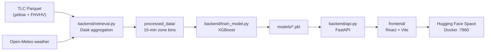

# Project Overview & Roadmap

> Generated for review — snapshot of architecture, current state, and planned updates.  
> Last updated: 2026-07-07

---

## What This Project Is

**surge_pred** is an NYC ride-share **Demand Excess Ratio (DER)** forecaster — a research/demo system that predicts supply–demand imbalance **15 minutes ahead** for TLC taxi zones. The goal is proactive surge management: signal drivers and adjust pricing before imbalance hits, rather than reacting after the fact.

It is explicitly **not** production pricing software. The UI and [`MODEL_CARD.md`](../MODEL_CARD.md) treat it as illustrative/educational.

---

## How It Works (End to End)



### 1. Data pipeline (`backend/retrieval.py`)

- Ingests **70M+** TLC trip rows from Parquet (kept out of git).
- Uses **Dask** for lazy, out-of-core processing.
- Bins trips into **15-minute × TLC zone** cells.
- Computes demand (pickups), supply proxy (dropoffs), lag features, weather joins, calendar/rush-hour flags, zone hints (airport, Manhattan core).
- Time-ordered train/test split via `train_test_split_date` in [`backend/config.yaml`](../backend/config.yaml) (currently `2026-03-01`; weather window `2025-01-01`–`2026-05-31`).

### 2. Training (`backend/train_model.py` + `backend/modeling.py`)

- **XGBoost** regressor on `Target_DER_t+15`.
- Writes `models/xgboost_surge_model.pkl` and `models/model_info.pkl` (feature list, metrics, calibration stats, data provenance).
- Optional MLflow tracking and hyperparameter tuning (off by default).

### 3. API (`backend/api.py`)

| Endpoint | Purpose |
|----------|---------|
| `GET /health` | Liveness |
| `GET /config/ui` | Slider bounds for the frontend |
| `GET /model-info` | Model metadata, split dates, calibration |
| `POST /predict` | DER forecast + uncertainty heuristics |
| `GET /interpretability/global-importance` | XGBoost gain importances |
| `POST /interpretability/shap` | TreeSHAP for a single input |

The API loads feature order from `model_info.pkl` so training and serving stay aligned. Predictions use a short TTL cache and tree-ensemble dispersion for uncertainty.

### 4. Frontend (`frontend/`)

- React app with **sliders** driven by `/config/ui` (avoids 400 validation errors).
- **Light / Dark / System** theme, **reduced-motion** support.
- Popular TLC zone presets, surge level coloring, model info panel.
- Vite dev server proxies API routes; production build is served by FastAPI or Docker.

### 5. Deployment

- **Dockerfile**: multi-stage build (Node frontend + Python API) on port **7860** for Hugging Face Spaces.
- **`deploy_to_hf.sh`**: uploads to Space `gabegaines24/ride-share-surge-forcasting` via `huggingface_hub`.
- **`scripts/refresh_tlc_data.py`**: downloads TLC Parquet with SHA256 manifest tracking.

---

## Tech Stack

| Layer | Tools |
|-------|-------|
| Data | Dask, Pandas, PyArrow, NYC TLC Parquet |
| Weather | Open-Meteo |
| ML | XGBoost, scikit-learn, SHAP |
| API | FastAPI, Uvicorn, Pydantic |
| Frontend | React, Vite, TypeScript |
| Config | `backend/config.yaml` |
| Deploy | Docker, Hugging Face Spaces |

---

## Repo Layout

```
surge_pred/
├── backend/           # FastAPI, retrieval, training, modeling
├── frontend/          # React UI
├── models/            # Trained artifacts (*.pkl)
├── processed_data/    # Dask pipeline output
├── taxi data/         # Raw TLC Parquet (gitignored)
├── scripts/           # TLC data refresh
├── docs/              # Documentation (this file)
├── Dockerfile         # HF Spaces / container deploy
├── MODEL_CARD.md      # Transparency & limitations
└── README.md          # Setup & usage
```

---

## Target Variable

**Demand Excess Ratio (DER) at t+15 minutes:**

```
y = Active_Requests(t+15) / Available_Drivers(t+15)
```

"Available drivers" is approximated from dropoff counts (supply proxy), not live fleet telemetry.

---

## Current State (as of 2026-07-07)

### Recently shipped

- Polished React UI: sliders, theme toggle, accessible controls, input clamping.
- `/config/ui` endpoint wired through Vite proxy.
- TLC refresh script + manifest gitignore.
- Model card and interpretability endpoints documented.
- HF deploy script added.

### On disk but not in git

- Trained model artifacts in `models/` (~309 KB XGBoost + `model_info.pkl`).
- TLC Parquet under `taxi data/` (multi-GB; gitignored).
- `future-updates.local.md` — private roadmap scratchpad (gitignored).

### Gaps / risks

1. **HF token in `deploy_to_hf.sh`** — a token is hardcoded in the repo. Rotate it on Hugging Face and switch to an env var (`HF_TOKEN`) before pushing that commit.
2. **No CI** — tests exist but aren't running in a pipeline; local pytest may fail outside the project venv (import/deps mismatch).
3. **Training coverage** — Yellow TLC Jan 2025–May 2026 with holdout from `2026-03-01`; FHVHV still optional (large).
4. **No shared type contract** — frontend TypeScript types are hand-maintained vs OpenAPI.

---

## Future Updates Plan

Organized by priority. Items marked ✅ are largely done already.

### Phase 1 — Stabilize & ship (1–2 weeks)

| Task | Why |
|------|-----|
| **Rotate HF token; use `HF_TOKEN` env var** | Security — don't commit secrets |
| **Push main + verify HF Space builds** | Unblock public demo |
| **GitHub Actions CI**: `pytest`, frontend `npm run build`, maybe ruff/mypy | Catch regressions on PR |
| **Pin Python 3.12 + Node 20** (`.python-version`, `engines` in `package.json`) | Match Dockerfile; reproducible dev |
| **Fix local dev bootstrap** (`pip install -e ".[dev]"`, document venv) | Tests fail on system Python 3.13 |

### Phase 2 — Refresh the model (2–4 weeks)

| Task | Why |
|------|-----|
| Run `refresh_tlc_data.py` for newer months | Keep forecasts relevant |
| Bump `weather_start/end` and `train_test_split_date` in config | Align weather + holdout with new data |
| `python -m backend.retrieval` → `python -m backend.train_model` | Regenerate artifacts |
| Document split dates in README + verify `GET /model-info` | Transparency for demo users |
| Optional: enable MLflow for one tuning run | Compare configs systematically |

**Retrain checklist:**

```bash
python scripts/refresh_tlc_data.py --yellow --fhvhv --year 2025 --months 1-6
# Update backend/config.yaml: weather_start, weather_end, train_test_split_date
python -m backend.retrieval
python -m backend.train_model
uvicorn backend.api:app --reload --port 8000
```

### Phase 3 — API hardening (as demo traffic grows)

| Task | Why |
|------|-----|
| Rate limiting + optional API key on `/predict` | Prevent Space abuse |
| `POST /predict/batch` for backtests | Useful for evaluation |
| OpenAPI examples pre-filled in Swagger | Better DX |
| ✅ SHAP + global importance | Already built |
| Drift monitoring (simple PSI/KS vs training distributions) | Early warning if inputs shift |

### Phase 4 — Frontend & demo polish

| Task | Why |
|------|-----|
| ✅ Dark mode, reduced motion, sliders, zone validation | Done |
| `og:image` with stable absolute URL | Better link previews when shared |
| **Map picker** for TLC zones (click NYC polygon) | High-impact demo UX; heavier lift |
| Surface SHAP in UI (e.g. "why this prediction?") | Makes interpretability endpoints visible |
| Show uncertainty bands from API in the result card | Uses existing calibration fields |

### Phase 5 — ML experiments (ongoing / portfolio depth)

| Task | Why |
|------|-----|
| LightGBM or temporal model baseline | Honest comparison in model card |
| Quantile regression or isotonic calibration | Better uncertainty than tree-variance heuristic |
| Event features (stadium schedules, holidays file) | Mentioned in README; may be partial today |
| Contract tests: OpenAPI → TypeScript codegen | Eliminate frontend/backend drift |

### Phase 6 — Ops (if you outgrow HF Spaces)

| Task | Why |
|------|-----|
| Deploy API to Railway/Fly/Cloud Run with health checks | Autoscaling, custom domain |
| Load test (`locust`/`k6`) against `/predict` | Size instances correctly |
| Weather cache TTL runbook | Document fallback when Open-Meteo is down |

---

## Suggested Next Steps

Highest-leverage order:

1. **Security fix** — rotate HF token, rewrite `deploy_to_hf.sh` to read from env.
2. **CI skeleton** — one GitHub Action that runs pytest + frontend build.
3. **Data refresh** — download latest TLC months, retrain, redeploy Space.

---

## Quick Reference Commands

```bash
# Local dev
uvicorn backend.api:app --reload --port 8000
cd frontend && npm install && npm run dev

# Docker (matches HF Spaces)
docker build -t surge-pred .
docker run --rm -p 7860:7860 surge-pred

# Tests
pip install -e ".[dev]"
pytest backend/tests/

# TLC data refresh
python scripts/refresh_tlc_data.py --yellow --year 2025 --months 1-6
```

---

## Related Docs

- [`README.md`](../README.md) — setup, pipeline, API endpoints
- [`MODEL_CARD.md`](../MODEL_CARD.md) — limitations, biases, uncertainty definitions
- [`backend/config.yaml`](../backend/config.yaml) — paths, model hyperparameters, data split dates
